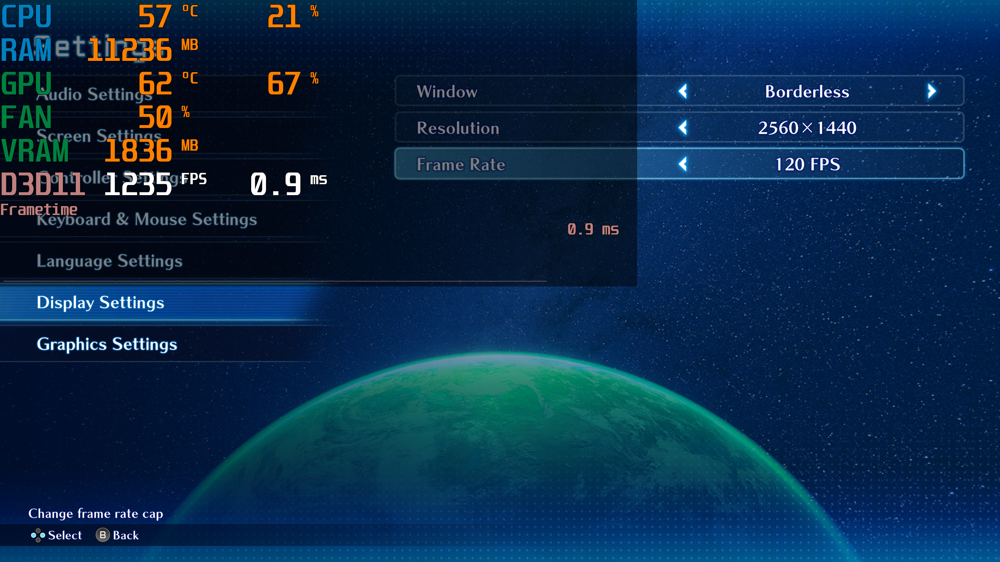
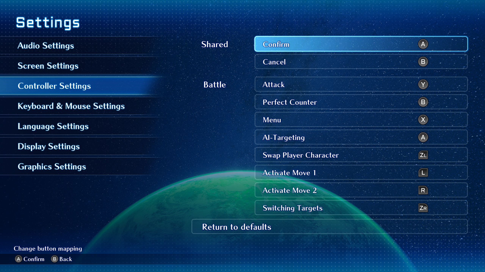

# SO2RTweaks
A BepInEx plugin for Star Ocean: The Second Story R.

* Configurable run in background.
* Force specific controller button prompts (PS4, PS5, Switch, XBOX).
* Skip intro.
* Framerate unlocker.
* Anisotropic filtering.

## Installation
* Download the [latest release](../../releases/latest).
* Extract the contents of the zip file into the game folder (e.g. `..\steamapps\common\STAR OCEAN THE SECOND STORY R`).
* The first boot of the game after the installation may take a while as BepInEx will be generating its things.

### Steam Deck / Linux Instructions
* Open up the game properties in Steam and add `WINEDLLOVERRIDES="winhttp=n,b" %command%` to the launch options.

## Configuration
* See **`<GAME_FOLDER>\BepInEx\config\SO2RTweaks.cfg`** after the first launch to adjust the settings.

## Thanks
[BepInEx](https://github.com/BepInEx/BepInEx)

## Screenshots
|||
|:-:|:-:|
|Unlocked Framerate|Nintendo Switch Buttons|
