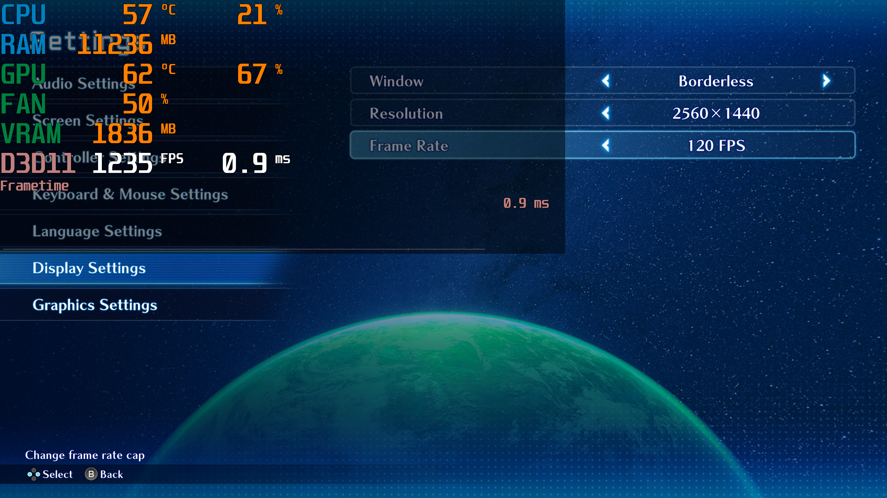

# SO2RTweaks
This is a BepInEx plugin for **Star Ocean: The Second Story R** that adds a framerate unlocker, intro skip, button prompts and more.

## Features
* Pause Render In Background.
* Force Controller Button Prompts (PS4, PS5, Switch, XBOX).
* Skip Intro.
* Framerate Unlocker.
* Anisotropic Filtering.
* Post-Process Anti-Aliasing (FXAA, SMAA).
* Disable Vignette.

## Installation
* Download the [latest release](../../releases/latest).
* Extract the contents of the zip file into the game folder (e.g. `..\steamapps\common\STAR OCEAN THE SECOND STORY R`).
* The first boot of the game after the installation may take a while as BepInEx will be generating its things.

### Steam Deck / Linux Instructions
* Open up the game properties in Steam and add `WINEDLLOVERRIDES="winhttp=n,b" %command%` to the launch options.

## Configuration
* See **`<GAME_FOLDER>\BepInEx\config\SO2RTweaks.cfg`** after the first launch to adjust the settings.

## Thanks
[BepInEx](https://github.com/BepInEx/BepInEx)

## Visual Comparisons

### General
|||
|:-:|:-:|
|Framerate Unlocker <small>To infinity and beyond!</small>|Nintendo Switch Buttons <small>With an XInput controller</small>|

### Anisotropic Filtering
* Look at the roof on the left and the textures further in the background.

|||
|:-:|:-:|
|Not Forced 4x (Game Default)|Forced 16x|

### Post-Process Anti-Aliasing
* FXAA removes more jagged edges, but it is slightly more blurry.
* SMAA produces a sharper image.

|||
|:-:|:-:|
|MSAA 4x + **FXAA**|MSAA 4x + **SMAA**|

### Vignette
* Vignette is a visual effect that darkens the corners of the screen.

|||
|:-:|:-:|
|Enabled (Game Default)|Disabled|
