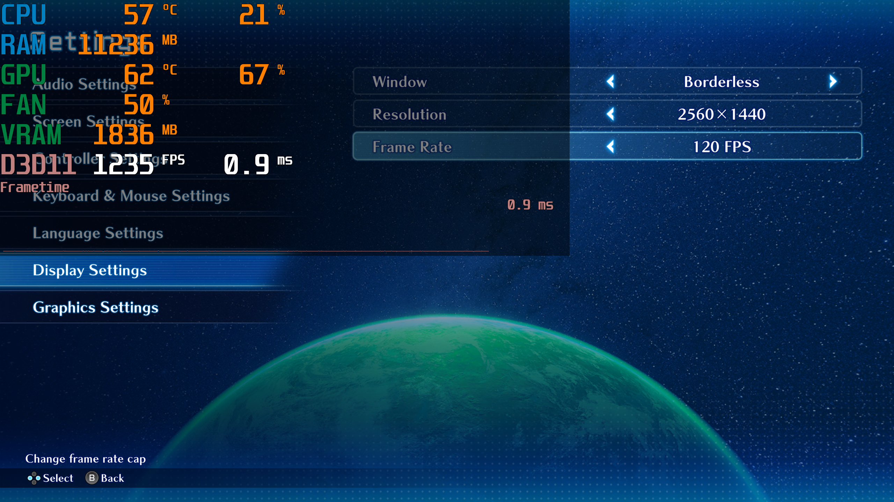
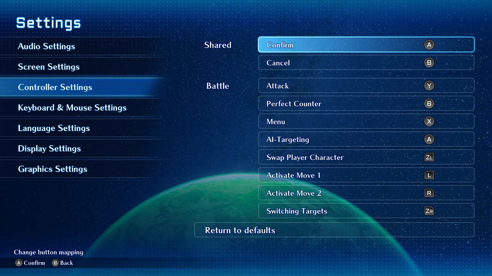
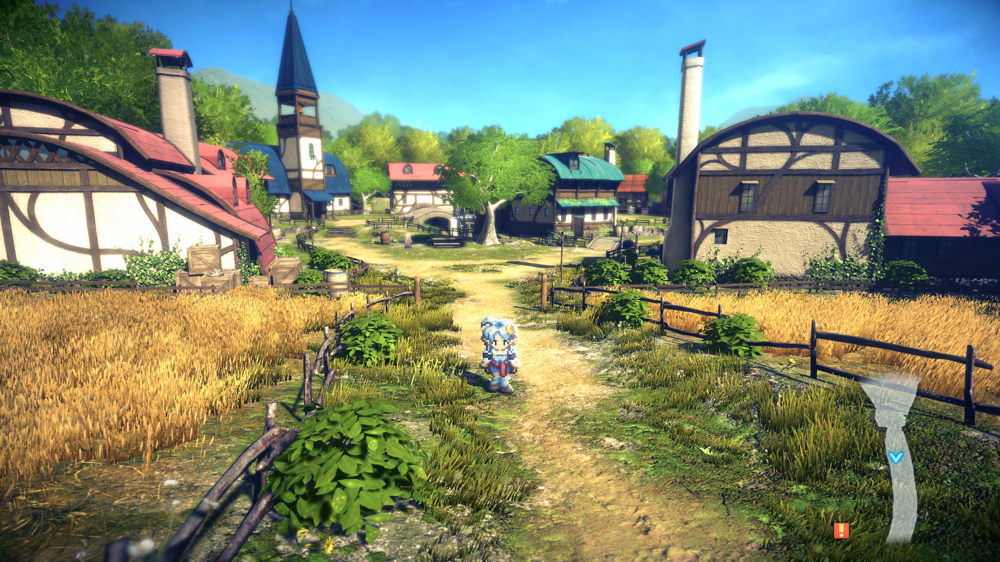
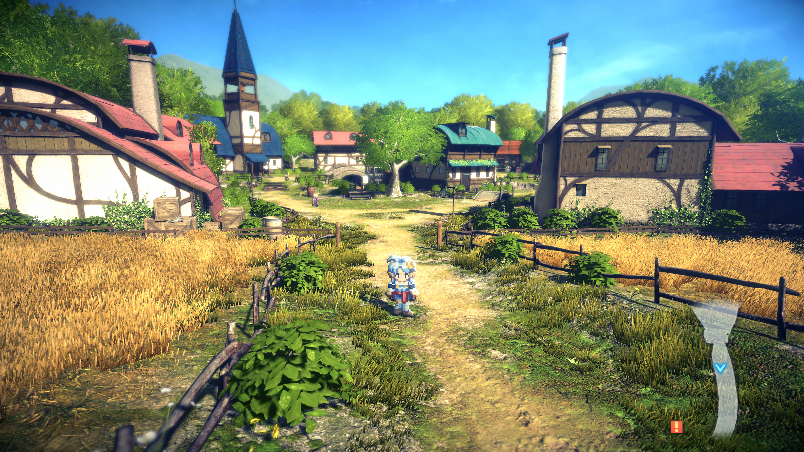

# SO2RTweaks
This is a BepInEx plugin for **Star Ocean: The Second Story R** that adds a framerate unlocker, intro skip, button prompts and more.

## Features
* Pause Render In Background.
* Force Controller Button Prompts (PS4, PS5, Switch, XBOX).
* Skip Intro.
* Framerate Unlocker.
* Anisotropic Filtering.
* Post-Process Anti-Aliasing (FXAA, SMAA).
* Shadow Distance Multiplier.
* Field Pop-in Reduction.
* Disable Vignette.

## Installation
* Download the [latest release](../../releases/latest).
* Extract the contents of the zip file into the game folder (e.g. `..\steamapps\common\STAR OCEAN THE SECOND STORY R`).
* The first boot of the game after the installation may take a while as BepInEx will be generating its things.

### Steam Deck / Linux Instructions
* Open up the game properties in Steam and add `WINEDLLOVERRIDES="winhttp=n,b" %command%` to the launch options.

## Configuration
* See **`<GAME_FOLDER>\BepInEx\config\SO2RTweaks.cfg`** after the first launch to adjust the settings.

## Thanks
[BepInEx](https://github.com/BepInEx/BepInEx)

## Visual Comparisons

### General
|||
|:-:|:-:|
|Framerate Unlocker <small>To infinity and beyond!</small>|Nintendo Switch Buttons <small>With an XInput controller</small>|

### Anisotropic Filtering
* Look at the roof on the left and the textures further in the background.

|||
|:-:|:-:|
|Not Forced 4x (Game Default)|Forced 16x|

### Post-Process Anti-Aliasing
* FXAA removes more jagged edges, but it is slightly more blurry.
* SMAA produces a sharper image.

|||
|:-:|:-:|
|MSAA 4x + **FXAA**|MSAA 4x + **SMAA**|

### Field Grass Culling and Shadows Distance
* The `FieldGrassCulling` setting controls the distance that bushes and plants will continue to be rendered on screen. It is a separate system from the `Cull Distance` in the game options.

  > [!NOTE]
  > The game uses a very low value, around 15 to 50 meters. This causes vegetation objects such as bushes and plants to disappear very close to the camera.
  >
  > I recommend leaving the value at 300. In my tests, this was more than enough to stop objects from popping in.
  >
  > Don't forget to set the `Cull Distance` option in the game to `Farthest` for the best experience.
  
  > [!IMPORTANT]
  > This setting does not affect the terrain grass, which fade away smoothly as you walk away.
  >
  > Using a value that is too high may cause performance degradation depending on your setup.

* The `ShadowDistanceMultiplier` setting controls the general shadow distance multiplier.
  
  > [!NOTE]
  > The rendering distance for shadows in the game is quite low, around 35 to 50 meters. This causes an effect similar to mesh swap pop-in, as objects stop to render shadows depending on distance.
  >
  > I recommend leaving the multiplier at 4. In my tests, this was more than enough to prevent shadows from disappearing from the camera view.
  >
  > Recommended for use in conjunction with the `FieldGrassCullingDistance` option setting for the best experience.

  > [!IMPORTANT]
  > Using a multiplier that is too high may cause performance degradation depending on your setup.

||||
|:-:|:-:|:-:|
|Game Default ShadowDistanceMultiplier 1x (Game Default)|FieldGrassCullingDistance 300 ShadowDistanceMultiplier 1x (Game Default)|FieldGrassCullingDistance 300 ShadowDistanceMultiplier 4x|

### Vignette
* Vignette is a visual effect that darkens the corners of the screen.

|||
|:-:|:-:|
|Enabled (Game Default)|Disabled|
